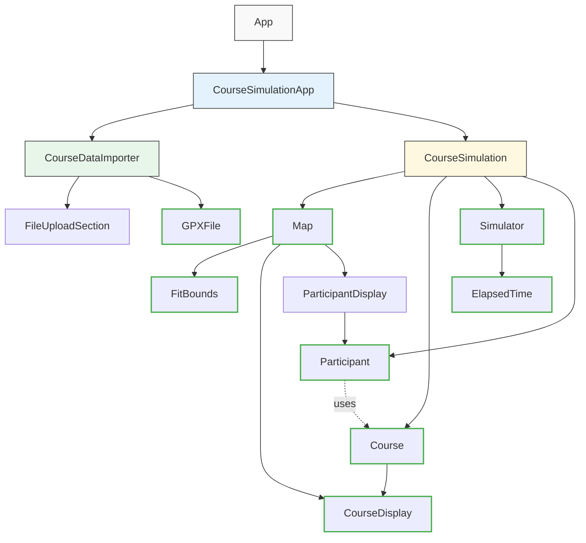

# Crashcourse

How accessible is this 5km course? Will participants and the public be able to enjoy the space together? Let's find out!

## What

1. Upload a course GPS data file (supported formats: `.gpx`, `.fit`).
2. See the course overlaid on OpenStreetMap.
3. Given a default path width, adjust it and specify narrower and wider sections.
4. Run simulations of walkers, joggers, and runners of varying paces and numbers following this course and highlight any areas of congestion. Add in some public path users with prams and bikes for good measure.
5. Tweak your course for accessibility, following the visualisations.
6. Share your course with others via a shareable URL that includes all course data, metadata, and lap detection parameters.

## Developing

To set up the development environment:

1. Clone the repository:

   ```bash
   git clone johnsyweb/crashcourse
   cd crashcourse
   ```

2. Install dependencies:

   ```bash
   pnpm install
   ```

3. Start the development server:

   ```bash
   pnpm run dev
   ```

4. Open your browser and navigate to the provided local development URL.

## Contributing

We welcome contributions! To contribute:

1. Fork the repository and create your branch:

   ```bash
   git checkout -b feature/your-feature-name
   ```

2. Make your changes and commit them using Commitizen for conventional commits:

   ```bash
   pnpm commit
   ```

3. Push to your fork:

   ```bash
   git push origin feature/your-feature-name
   ```

4. Open a pull request on the main repository.

Please ensure your code follows the project's coding standards and includes tests where applicable.

## Components and Responsibilities

### CourseSimulationApp

The main coordinator for the application flow. It handles the switching between the course data import and simulation stages, maintaining the state of the GPS course points.

### CourseDataImporter

Handles the importing and processing of GPS course data. It manages the file selection interface and handles the parsing of GPS files through the GPXFile and FITFile components.

### CourseSimulation

Manages the visualisation and interactive simulation of the course. It coordinates between the Map, Course, and Simulator components to provide a coherent simulation experience.

### FileUploadSection

A reusable component for the file upload interface, allowing users to select GPS files.

### GPXFile

A specialized component that handles parsing and processing of GPX files. Features include:

- Parsing XML data from GPX files
- Extracting track points with coordinates
- Error handling for malformed or incomplete GPS data
- Providing structured data (start/endpoints, track points) to parent components

### FITFile

A specialized component that handles parsing and processing of FIT files. Features include:

- Parsing binary FIT file format
- Extracting position records with coordinates (converting from semicircles to degrees)
- Error handling for malformed or incomplete GPS data
- Providing structured data (start/endpoints, track points) to parent components

### Course

A model representing an event course, defined by a series of geographical points. Features include:

- Calculating the total course length using turf.js for accurate geodesic calculations
- Providing access to start and finish points
- Finding coordinates at any specific distance along the course
- Determining the distance of a given position relative to the course
- Calculating the left and right edges of the course
- Identifying the narrowest and widest parts of the course and their widths
- Modeling course width based on parallel paths and intersections
- Supporting dynamic width calculations at any point along the course

### CourseDisplay

A visualisation component for rendering a course on a map. Features include:

- Rendering the course path as a polyline
- Displaying start and finish markers
- Optional kilometre markers along the course
- Customisable line styling
- Marking the narrowest and widest points of the course with annotations

### Map

A reusable component that renders a Leaflet map with the ability to:

- Display geographical data using OpenStreetMap tiles
- Automatically fit map bounds to show all GPS points
- Accept children components like course paths and participant markers
- Customize initial center position and zoom level

### Simulator

Controls the simulation of participants' movement along a course. Features include:

- Start/stop/reset controls for the simulation
- Dynamic updating of participant positions based on elapsed time
- Real-time feedback on course length, width information, and participant count
- Integration with ElapsedTime for timing control
- Display of course width statistics (narrowest and widest points)

### ElapsedTime

A reusable timer component that displays and controls elapsed time. Features include:

- Start/stop/reset functionality with both button and keyboard controls (P, S, R keys)
- Visual display of elapsed time in minutes and seconds
- Callback support to notify parent components of time changes

### Participant

A model representing a participant in the simulation. Features include:

- Tracking position along a course based on clock ticks, pace, and tick duration
- Calculating cumulative distance travelled
- Supporting different paces (specified as minutes:seconds per kilometre)
- Reset capability to return to starting position
- Built to work directly with the Course class for efficient distance calculations and position determination

### FitBounds

A utility component that automatically adjusts the map view to fit all GPS points within the visible area.

### Course Sharing

Shareable course functionality that allows users to share courses via URL. Features include:

- Encodes course data (points, metadata, lap detection parameters) into a base64-encoded URL parameter
- Automatically loads course data from URL when app starts
- Generates shareable links that work across browsers
- Includes complete course configuration including lap detection settings
- Versioned data format for future compatibility

### Component Relationships



### Assets

Contains static assets such as icons for markers used in the map visualization.

## Licence

MIT
