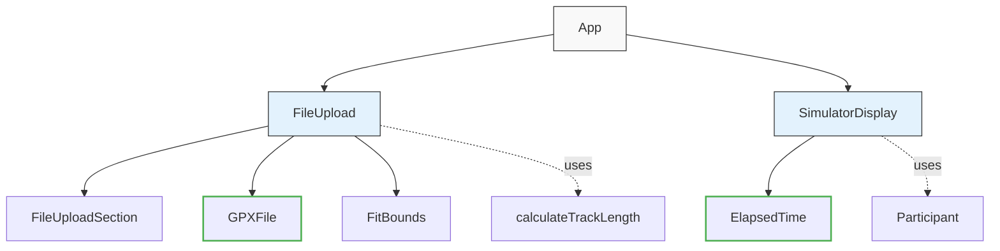

# Crashcourse

How accessible is this 5km course? Will participants and the public be able to enjoy the space together? Let's find out!

## What

1. Upload a course GPS data file (supported formats: `.gpx`, `.kml`).
2. See the course overlaid on OpenStreetMap.
3. Given a default path width, adjust it and specify narrower and wider sections.
4. Run simulations of walkers, joggers, and runners of varying paces and numbers following this course and highlight any areas of congestion. Add in some public path users with prams and bikes for good measure.
5. Tweak your course for accessibility, following the visualisations.

## Developing

To set up the development environment:

1. Clone the repository:

   ```bash
   git clone johnsyweb/crashcourse
   cd crashcourse
   ```

2. Install dependencies:

   ```bash
   pnpm install
   ```

3. Start the development server:

   ```bash
   pnpm run dev
   ```

4. Open your browser and navigate to the provided local development URL.

## Contributing

We welcome contributions! To contribute:

1. Fork the repository and create your branch:

   ```bash
   git checkout -b feature/your-feature-name
   ```

2. Make your changes and commit them using Commitizen for conventional commits:

   ```bash
   pnpm commit
   ```

3. Push to your fork:

   ```bash
   git push origin feature/your-feature-name
   ```

4. Open a pull request on the main repository.

Please ensure your code follows the project's coding standards and includes tests where applicable.

## Components and Responsibilities

### FileUpload

Handles the overall simulation setup and visualization. It manages the state of the uploaded course data and renders the map with markers.

### FileUploadSection

A reusable component for the file upload interface, allowing users to select GPS files.

### GPXFile

A specialized component that handles parsing and processing of GPX files. Features include:
- Parsing XML data from GPX files
- Extracting track points with coordinates
- Error handling for malformed or incomplete GPS data
- Providing structured data (start/endpoints, track points) to parent components

### SimulatorDisplay

Displays simulation controls, including playback speed adjustment and course length information.

### ElapsedTime

A reusable timer component that displays and controls elapsed time. Features include:
- Start/stop/reset functionality with both button and keyboard controls (P, S, R keys)
- Visual display of elapsed time in minutes and seconds
- Callback support to notify parent components of time changes

### Participant

A model representing a participant in the simulation. It calculates the participant's position, pace, and cumulative distance based on elapsed time and GPS points.

### FitBounds

Adjusts the map view to fit all GPS points within the visible area.

### Utilities

- **calculateTrackLength**: Calculates the total length of the course based on GPS points.

### Component Relationships



### Assets

Contains static assets such as icons for markers used in the map visualization.

## Licence

MIT

### TODO

- [ ] Extract more components, using ElapsedTime as an example.
  - [x] GPXFile, a specialized component that handles parsing and processing of GPX files.
  - [ ] Course, describing where an event takes place, defined by a series of points between the start and finish point. Has properties such as:
    - [ ] Start point
    - [ ] Finish point
    - [ ] Length, the distance from the start to the finish passing through each of the points in sequence
  - Can also be queried for the coordinates of a point a given distance from the start
  - [ ] Participant, an individual who travels the length of the course at their prefered pace
  - [ ] Map, a graphical representation of the local geography upon which a course and participants may be overlaid.
  - [ ] Simulator, given a course and a timer, can play participants' progress along the course.
